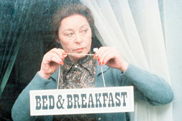

# Landlady

Php utility to deal with ~~tenants~~ subdomains and other host-related properties.

* get host, domain, subdomain, protocol
* force https or www
* ask for urls and pretty labels (with or *without* subdomain)

## How to

```php
use SSITU\Landlady;

require_once 'path/to/autoload.php';

$Landlady = new Landlady(bool $forceHttps = false, bool $forceWww = false);

$Landlady->protocol;
$Landlady->host;
$Landlady->subdomain;
$Landlady->domain;

$Landlady->hostUrl;
$Landlady->hostLabel;
# or
$Landlady->hostUrl(?string $addPath = null);
$Landlady->hostLabel(?string $addPath = null);

$Landlady->domainUrl;
$Landlady->domainLabel;
# or
$Landlady->domainUrl(?string $addPath = null);
$Landlady->domainLabel(?string $addPath = null);

$Landlady->altHost(string $newSubdomain);
$Landlady->altHostUrl(string $newSubdomain, ?string $addPath = null);
$Landlady->altHostLabel(string $newSubdomain, ?string $addPath = null);
```

You can also run `test/LandladyTest.php`.

## Contributing

Sure! :raised_hands:
You can take a loot at [CONTRIBUTING](CONTRIBUTING.md).  

## License

This project is under the MIT License; cf. [LICENSE](LICENSE) for details.

## Reference

[The Landlady](https://en.wikipedia.org/wiki/The_Landlady_(short_story)) is a short horror story by Roald Dahl.  

  
